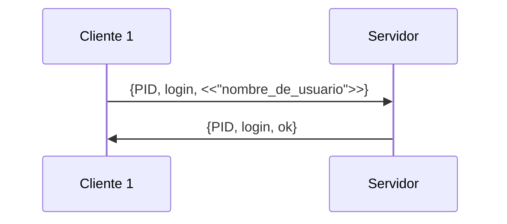
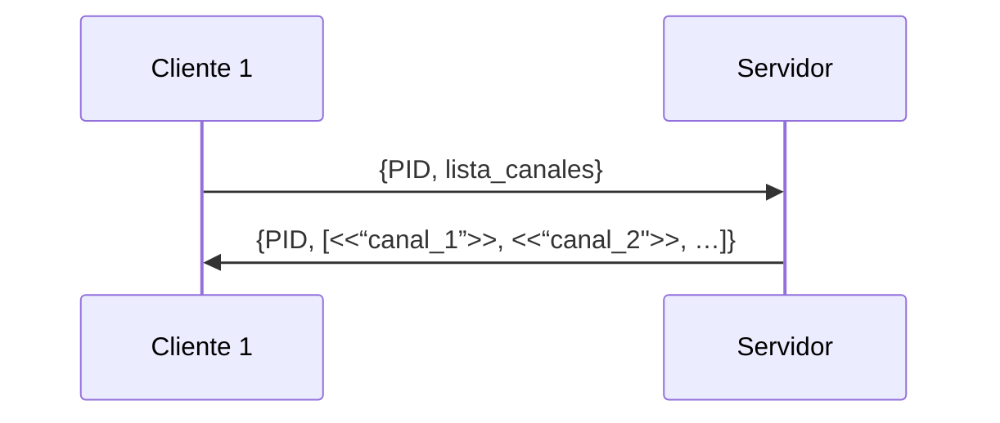
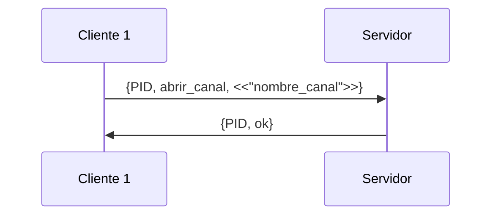
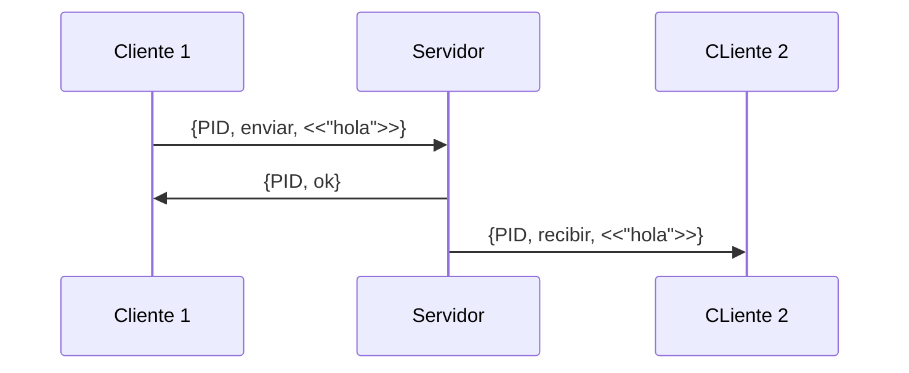
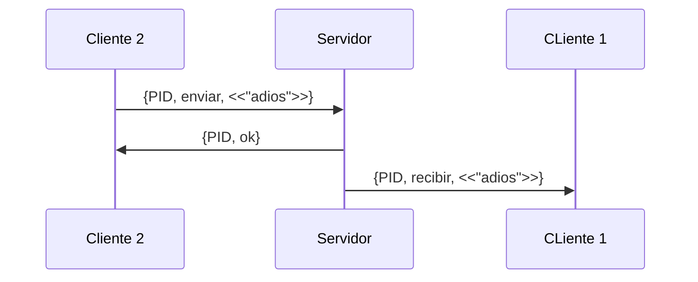
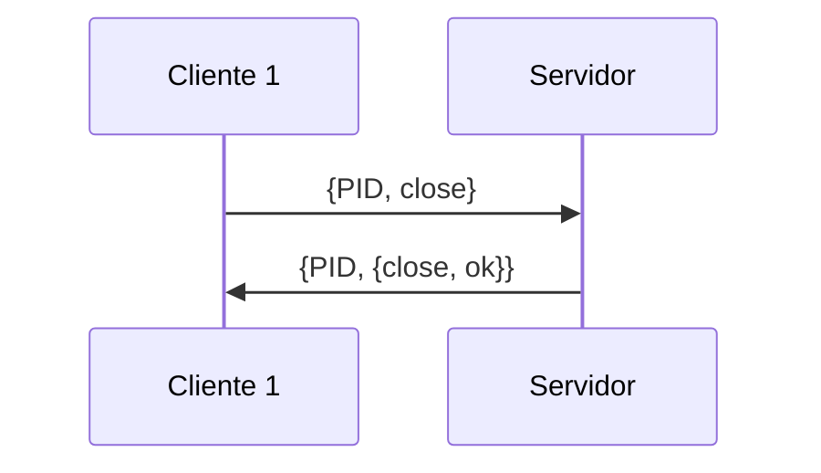

# Aplicación de chat en Erlang

[TOC]

## Casos de uso

### Iniciar sesión

```mermaid
sequenceDiagram
    Cliente 1 ->> Servidor: {PID, login, <<"nombre_de_usuario">>}
		Servidor ->> Cliente 1: {PID, login, ok}
```

### Listar canales

```mermaid
sequenceDiagram
    Cliente 1 ->> Servidor: {PID, lista_canales}
	Servidor ->> Cliente 1: {PID, [<<“canal_1”>>, <<“canal_2">>, …]}
   
```

### Abrir canales   

```mermaid
sequenceDiagram
   Cliente 1 ->> Servidor: {PID, abrir_canal, <<"nombre_canal">>}
   Servidor ->> Cliente 1: {PID, ok}

```

### Enviar mensaje

```mermaid
sequenceDiagram
   Cliente 1 ->> Servidor:{PID, enviar, <<"hola">>}
   Servidor ->> Cliente 1: {PID, ok}
   Servidor ->> CLiente 2:{PID, recibir, <<"hola">>}
```

### Recibir mensaje

```mermaid
sequenceDiagram

   Cliente 2 ->> Servidor:{PID, enviar, <<"adios">>}
   Servidor ->> Cliente 2: {PID, ok}
   Servidor ->> CLiente 1:{PID, recibir, <<"adios">>}
   
```

### Cerrar sesión

```mermaid
sequenceDiagram
   Cliente 1->> Servidor: {PID, close}
   Servidor ->> Cliente 1: {PID, {close, ok}}
```